# Pandas – Einführung in DataFrames

## Lernziele

Nach Bearbeitung dieses Arbeitsblatts kannst du:

- Pandas importieren und DataFrames erstellen
- CSV-Dateien laden und erste Erkundungen durchführen
- Grundlegende Informationen über Datensätze abrufen
- Datentypen verstehen und konvertieren

!!! note "Begleitende Infoblätter"
    - [:material-book-open-variant: Pandas Grundlagen](../infoblaetter/pandas-grundlagen.md) – DataFrame & Series
    - [:material-book-open-variant: NumPy Grundlagen](../infoblaetter/numpy-grundlagen.md) – Arrays als Basis
    
    Lies das Infoblatt **zuerst**, bevor du die Aufgaben bearbeitest. Dort findest du alle Syntax-Beispiele und Erklärungen zu DataFrames und Series.

---

## Einführung

Pandas ist **die** Python-Bibliothek für Datenanalyse. Sie baut auf NumPy auf und bietet mächtige Datenstrukturen für tabellarische Daten.

<div class="notebook-hint" markdown>
<span class="notebook-hint-icon">📓</span>
<div class="notebook-hint-text">
<strong>Bearbeite alle Aufgaben in einem Jupyter Notebook</strong>
<small>Öffne JupyterLite direkt im Browser – keine Installation nötig!</small>
</div>
<a href="https://berndheidemann.github.io/dpa_numpy_pandas_jupyter_site/jupyter/lab/index.html" target="_blank" class="jupyter-button">
🚀 JupyterLite öffnen
</a>
</div>

**Pandas Datenstrukturen:**

| Struktur | Beschreibung | Analogie |
|----------|--------------|----------|
| **DataFrame** | Tabelle mit Zeilen × Spalten | Excel-Tabelle |
| **Series** | Eine einzelne Spalte mit Index | Liste mit Beschriftung |

```python
# Ein DataFrame enthält mehrere Series (Spalten)
df = pd.DataFrame({
    'Name': ['Max', 'Anna'],      # ← Series
    'Alter': [25, 30],            # ← Series
    'Stadt': ['Berlin', 'München'] # ← Series
})
```

!!! abstract "Datensatz herunterladen"
    [:material-download: games.csv](../assets/files/games.csv){ .md-button }

---

## Aufgaben

### Aufgabe 1 – Pandas importieren und DataFrame erstellen

Importiere Pandas und erstelle dein erstes DataFrame manuell.

- [ ] Importiere Pandas mit dem Alias `pd` und NumPy mit dem Alias `np`
- [ ] Gib die Pandas-Version aus
- [ ] Erstelle ein Dictionary mit Daten für 4 Personen (Name, Alter, Stadt, Gehalt)
- [ ] Erstelle daraus ein DataFrame und gib es aus
- [ ] Gib folgende Eigenschaften des DataFrames aus: Shape, Spaltennamen, Index, Gesamtzahl der Werte

!!! tip "Hilfe"
    - Import: `import pandas as pd`
    - Version prüfen: `pd.__version__`
    - DataFrame aus Dictionary: `pd.DataFrame(dict)`
    - Eigenschaften: `df.shape`, `df.columns`, `df.index`, `df.size`

---

### Aufgabe 2 – CSV-Dateien laden

Lade einen echten Datensatz aus einer CSV-Datei und verschaffe dir einen ersten Überblick.

- [ ] Lade den Games-Datensatz (`../assets/files/games.csv`) in ein DataFrame
- [ ] Gib die Shape des Datensatzes aus
- [ ] Zeige die ersten 5 Zeilen an
- [ ] Zeige die ersten 10 Zeilen an
- [ ] Zeige die letzten 3 Zeilen an
- [ ] Zeige 5 zufällige Zeilen an

!!! tip "Hilfe"
    - CSV laden: `pd.read_csv(pfad)`
    - Erste/Letzte Zeilen: `df.head(n)`, `df.tail(n)`
    - Zufällige Stichprobe: `df.sample(n)`

---

### Aufgabe 3 – Datensatz erkunden

Untersuche die Struktur und den Inhalt des DataFrames im Detail.

- [ ] Zeige eine kompakte Übersicht mit Datentypen und Nicht-Null-Werten an
- [ ] Gib die Datentypen aller Spalten aus
- [ ] Berechne statistische Kennzahlen für alle numerischen Spalten
- [ ] Berechne statistische Kennzahlen für **alle** Spalten (inkl. kategorische)
- [ ] Zeige die Anzahl fehlender Werte pro Spalte an
- [ ] Berechne den Prozentsatz fehlender Werte pro Spalte

!!! tip "Hilfe"
    - Struktur-Info: `df.info()`, `df.dtypes`
    - Statistik: `df.describe()` – mit `include='all'` für alle Spaltentypen
    - Fehlende Werte: `df.isnull().sum()`
    - Prozentsatz: `(df.isnull().sum() / len(df) * 100)`

!!! question "Reflexionsfrage"
    Welche Spalten enthalten die meisten fehlenden Werte? Was könnte der Grund dafür sein?

---

### Aufgabe 4 – Spalten auswählen

Lerne den Unterschied zwischen Series und DataFrame bei der Spaltenauswahl.

```mermaid
flowchart LR
    subgraph df["DataFrame"]
        direction LR
        c1["Name"]
        c2["Alter"]
        c3["Stadt"]
        c4["Gehalt"]
    end
    
    result["<b>df['Name']</b><br>Typ: pandas.Series"]
    
    c1 --> |"Eine Spalte → Series"| result
    
    style c1 fill:#87CEEB
    style result fill:#87CEEB
```



- [ ] Wähle die Spalte `Name` aus und gib den Datentyp (`type()`) des Ergebnisses aus
- [ ] Zeige die ersten 5 Werte dieser Spalte an
- [ ] Wähle die Spalten `Name`, `Platform` und `Year_of_Release` gemeinsam aus
- [ ] Gib den Datentyp des Ergebnisses aus – was ist der Unterschied zur Einzelspalte?
- [ ] Benenne die Spalten `Name`, `Year_of_Release` und `Platform` in deutsche Namen um

!!! tip "Hilfe"
    - Eine Spalte (Series): `df['spalte']`
    - Mehrere Spalten (DataFrame): `df[['spalte1', 'spalte2']]`
    - Umbenennen: `df.rename(columns={'alt': 'neu'})`

---

### Aufgabe 5 – Datentypen verstehen und konvertieren

Analysiere und ändere die Datentypen im DataFrame.

- [ ] Gib für jede Spalte den Namen und Datentyp aus (nutze eine Schleife)
- [ ] Prüfe den Datentyp von `Year_of_Release` – ist er sinnvoll?
- [ ] Erstelle eine Kopie des DataFrames und ersetze fehlende Werte in `Year_of_Release` durch 0
- [ ] Konvertiere `Year_of_Release` in der Kopie zu Integer
- [ ] Konvertiere die Spalte `Platform` zu einem kategorischen Datentyp und vergleiche den Speicherverbrauch vorher/nachher

!!! tip "Hilfe"
    - Schleife über Spalten: `for col in df.columns:`
    - Kopie erstellen: `df.copy()`
    - NaN ersetzen: `df['spalte'].fillna(wert)`
    - Typ ändern: `df['spalte'].astype(typ)` – z.B. `int`, `'category'`
    - Speicherverbrauch: `df['spalte'].memory_usage()`

---

### Aufgabe 6 – Eindeutige Werte und Häufigkeiten

Analysiere die Verteilung von Werten in kategorialen Spalten.

- [ ] Finde heraus, wie viele verschiedene Plattformen es gibt
- [ ] Zeige alle eindeutigen Plattformen an
- [ ] Erstelle eine Häufigkeitstabelle der Top 10 Plattformen nach Anzahl Spiele
- [ ] Zeige die Top 5 Plattformen als Prozentsatz an
- [ ] Finde die 10 Jahre mit den meisten Spiele-Releases

!!! tip "Hilfe"
    - Anzahl eindeutiger Werte: `df['spalte'].nunique()`
    - Eindeutige Werte: `df['spalte'].unique()`
    - Häufigkeiten: `df['spalte'].value_counts()`
    - Als Prozentsatz: `df['spalte'].value_counts(normalize=True)`

---

### Aufgabe 7 – Sortieren

Sortiere DataFrames nach einer oder mehreren Spalten.

- [ ] Sortiere das DataFrame nach `Year_of_Release` (aufsteigend) und zeige die ältesten 5 Spiele mit Name, Jahr und Plattform
- [ ] Sortiere absteigend und zeige die 5 neuesten Spiele
- [ ] Sortiere nach `Platform` (aufsteigend) und innerhalb jeder Plattform nach `Year_of_Release` (absteigend)
- [ ] Zeige die ersten 10 Zeilen des Ergebnisses mit Name, Plattform und Jahr
- [ ] Setze den Index nach einer Sortierung zurück, sodass er wieder bei 0 beginnt

!!! tip "Hilfe"
    - Sortieren: `df.sort_values('spalte')` oder `df.sort_values('spalte', ascending=False)`
    - Mehrere Spalten: `df.sort_values(['spalte1', 'spalte2'], ascending=[True, False])`
    - Index zurücksetzen: `df.reset_index(drop=True)`

---

## Vertiefende Aufgaben

!!! tip "Optionale Aufgaben zur Vertiefung"
    Die folgenden Aufgaben sind **optional** und vertiefen das Gelernte. Sie eignen sich besonders für:
    
    - **Erste eigene Analysen auf dem Games-Datensatz**
    - **Kombination von Exploration, Filterung und Sortierung**
    - **Prüfungsvorbereitung** durch eigenständiges Arbeiten

---

### Aufgabe 8 – Erste Analysen

Beantworte Fragen zum Games-Datensatz mit Pandas-Code.

- [ ] Wie viele Spiele sind insgesamt im Datensatz?
- [ ] In welchem Jahr wurden die meisten Spiele veröffentlicht? Wie viele waren es?
- [ ] Welches Genre ist am häufigsten vertreten?
- [ ] Wie viele verschiedene Publisher gibt es?
- [ ] Welche Spalten haben fehlende Werte? Liste sie auf.

!!! tip "Hilfe"
    - Anzahl Zeilen: `len(df)` oder `df.shape[0]`
    - Häufigstes Element finden: `df['spalte'].value_counts().idxmax()` für den Wert, `.max()` für die Anzahl
    - Bedingte Auswahl: `series[series > 0]` filtert positive Werte

!!! tip "Methoden-Kette"
    Pandas erlaubt das Verketten von Methoden – statt Zwischenvariablen kannst du Methoden direkt aneinanderhängen:
    `df.sort_values('Year_of_Release').head(10)`

---

### Aufgabe 9 – Eigenständige Erkundung

!!! warning "Ohne Hilfe lösen"
    Bearbeite diese Aufgaben selbstständig mit dem Games-Datensatz.

**Aufgabe A: Datensatz verstehen**

- [ ] Welche 5 Spiele haben die höchste Kritikerwertung (`Critic_Score`)?
- [ ] Welcher Publisher hat die meisten Spiele veröffentlicht?
- [ ] In welchem Jahr wurden die meisten Spiele für die Plattform "PS4" veröffentlicht?
- [ ] Wie hoch ist der Anteil an Spielen ohne Altersfreigabe (`Rating` ist NaN)?

**Aufgabe B: Datenqualität prüfen**

- [ ] Erstelle eine Übersicht: Für jede Spalte zeige an:
    - Name
    - Datentyp
    - Anzahl fehlender Werte
    - Prozentsatz fehlender Werte
    - Anzahl eindeutiger Werte
- [ ] Welche Spalte hat die schlechteste Datenqualität?

**Aufgabe C: Sortierung und Auswahl**

- [ ] Sortiere nach Kritikerwertung (absteigend) und zeige die Top 20
- [ ] Finde alle Spiele, die im Jahr 2015 erschienen sind, sortiert nach Plattform
- [ ] Zeige alle Spiele eines bestimmten Publishers deiner Wahl

**Aufgabe D: Eigene Fragen**

- [ ] Formuliere 3 eigene interessante Fragen an den Datensatz und beantworte sie mit Pandas-Code:
    1. Frage: ...
    2. Frage: ...
    3. Frage: ...

---

## Zusammenfassung

!!! success "Das hast du gelernt"
    - **DataFrame erstellen**: `pd.DataFrame(dict)` oder `pd.read_csv()`
    - **Erkunden**: `.head()`, `.tail()`, `.info()`, `.describe()`
    - **Spalten**: `df['col']` (Series) oder `df[['a', 'b']]` (DataFrame)
    - **Häufigkeiten**: `.value_counts()`, `.nunique()`, `.unique()`
    - **Sortieren**: `.sort_values()` mit `ascending=True/False`
    - **Datentypen**: `.dtypes`, `.astype()` zum Konvertieren

---

??? question "Selbstkontrolle"
    1. Was ist der Unterschied zwischen `df['col']` und `df[['col']]`?
    2. Wie findest du heraus, wie viele verschiedene Werte eine Spalte hat?
    3. Welche Methode zeigt Speicherverbrauch und Datentypen aller Spalten?
    4. Wie sortierst du absteigend nach einer Spalte?
    
    ??? success "Antworten"
        1. `df['col']` gibt eine Series zurück, `df[['col']]` gibt einen DataFrame (mit einer Spalte) zurück
        2. `df['col'].nunique()` für die Anzahl, `df['col'].unique()` für die Werte selbst
        3. `df.info()` zeigt kompakte Übersicht mit Datentypen und Non-Null-Counts
        4. `df.sort_values('spalte', ascending=False)`
